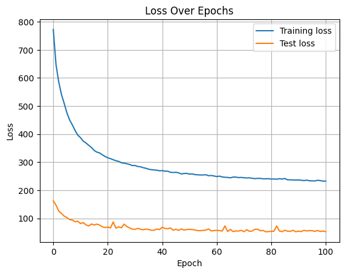
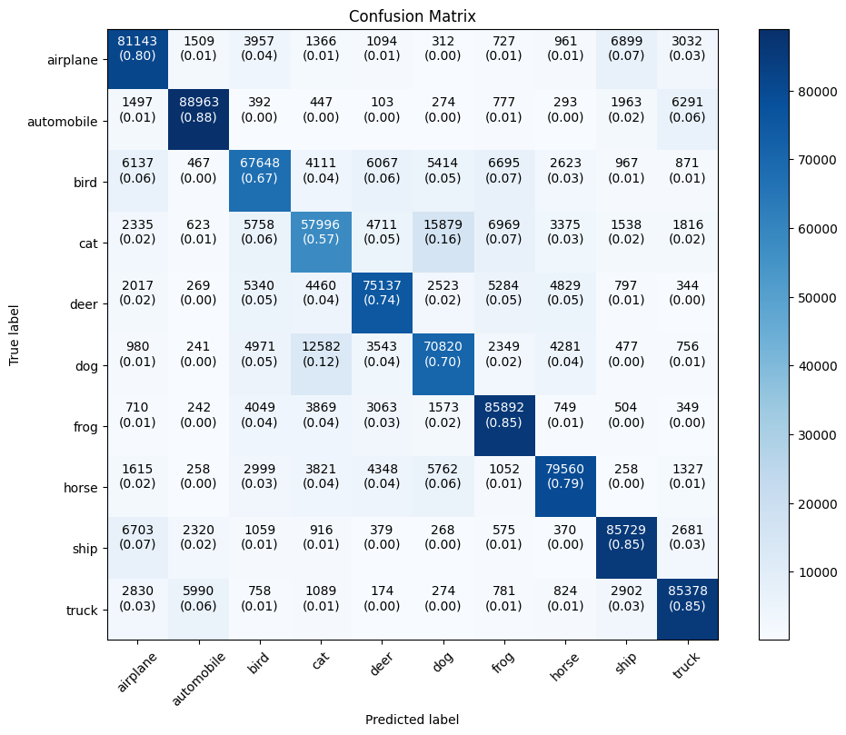
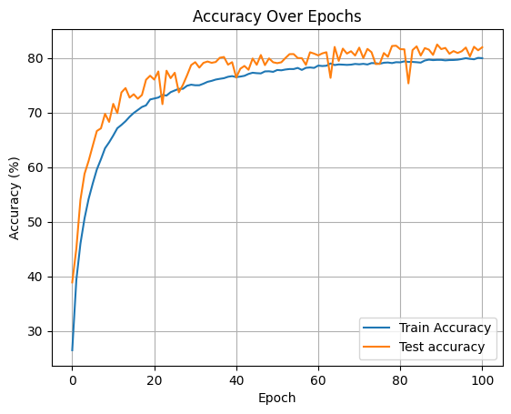
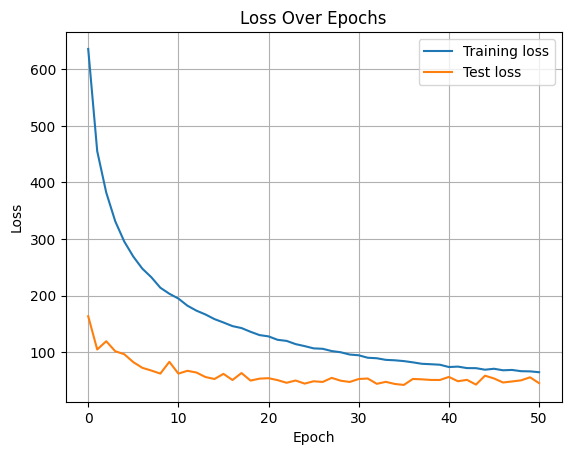
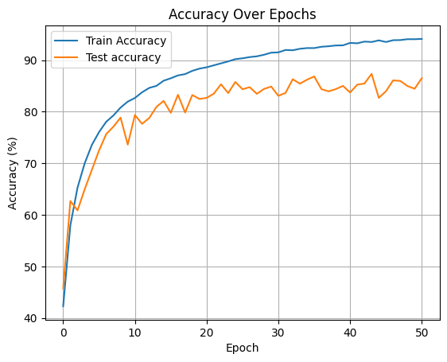

<h1 align="center">🚀 VisionNet: Custom CNN vs ResNet-18 on CIFAR-10</h1>

  <strong>Deep learning project comparing a custom CNN and ResNet-18 for image classification.</strong>

<h2>📌 Overview</h2>
<ul>
  <li><b>Developed and compared</b> a Custom CNN with ResNet-18 on the <b>CIFAR-10</b> dataset.</li>
  <li>Achieved <b>80% accuracy</b> with the custom CNN and <b>95%</b> with ResNet-18.</li>
  <li>Applied <b>data augmentation</b> and optimization techniques to enhance generalization.</li>
</ul>

<h2>🛠️ Setup Instructions</h2>
<ol>
  <li>Navigate to your target folder and run:</li>
  <pre><code>git clone https://github.com/HiteshReddy28/Visionnet.git</code></pre>

  <li>Create and activate a virtual environment:</li>
  <pre><code>python -m venv env</code></pre>
  <pre><code>
# Windows:
env\Scripts\activate

# macOS/Linux:
source env/bin/activate
</code></pre>

  <li>Install all dependencies:</li>
  <pre><code>pip install -r requirements.txt</code></pre>
</ol>

> ⚠️ <strong>Note:</strong> Ensure you have a GPU for faster training or use .

---

<h2>📊 Project Details</h2>

<h3>🎯 Objectives</h3>
<ul>
  <li>Design a custom CNN from scratch.</li>
  <li>Compare with deeper architecture (ResNet-18).</li>
  <li>Use augmentation and optimization to improve performance.</li>
</ul>

<h3>🧠 Architectures</h3>
<ul>
  <li><b>Custom CNN:</b> 3 Conv layers + 2 FC layers + Dropout → Accuracy: <b>80%</b></li>
  <li><b>ResNet-18:</b> Pretrained deep residual network → Accuracy: <b>95%</b></li>
</ul>

<h3>🧪 Data Preprocessing</h3>
<ul>
  <li>Random cropping</li>
  <li>Horizontal flipping</li>
  <li>Normalization</li>
</ul>

---

<h2>📈 Key Results</h2>
<ul>
  <li><strong>Custom CNN Accuracy:</strong> 80%</li>
  <li><strong>ResNet-18 Accuracy:</strong> 95%</li>
</ul>

---

<h2>📉 Custom CNN Results</h2>
<ul>
  <li>Loss Curve: </li>
  <li>Confusion Matrix: </li>
  <li>Accuracy Curve: </li>
</ul>

<h2>📉 ResNet-18 Results</h2>
<ul>
  <li>Loss Curve: </li>
  <li>Confusion Matrix: </li>
  <li>Accuracy Curve: </li>
</ul>

---

<h2>🧾 Conclusion</h2>

  While our custom CNN achieved decent results, ResNet-18 significantly outperformed it due to its depth and ability to extract complex features. This project highlights how established architectures can enhance performance in complex image classification tasks.

---

<h2>🔗 Useful Links</h2>
<ul>
  <li>▶️ </li>
  <li>🖥️ <a href="https://docs.google.com/presentation/d/1JIFxix1zAMHIwhD-1Cj4Kzrg4Uj2Nrq7JpEQZrQO7qw/edit" target="_blank">Presentation Slides</a></li>
</ul>

---

<!--<h2>🙌 Contributors</h2>
<ul>
  <li><strong>Sai Nagesh Gowra Balaji</strong> – <a href="https://linkedin.com/in/sai-nagesh">LinkedIn</a></li>
</ul>--->
